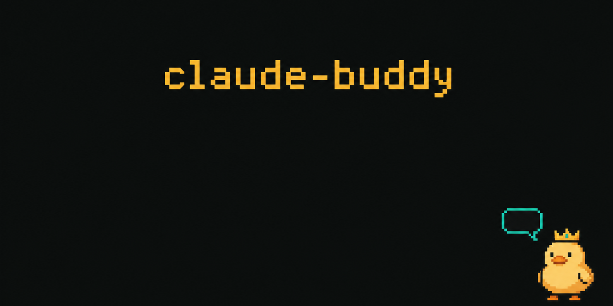

`claude-buddy` brings back the terminal pet Anthropic shipped for one week and then took away.

```
you@box ~/proj (main) $ claude
...working...
                                                  Crumb ★★  ~ "third retry. bold."
```
*(illustrative status line render, not a real screenshot)*

## What it is

In April 2026, Claude Code shipped `/buddy` as an April Fools feature: a small creature
that sat bottom-right of the terminal UI, commented on what you were doing, and answered
when you talked to it. It ran for about a week across versions 2.1.89 through 2.1.94, then
got pulled. People noticed it was gone and asked for it back.

This is a clean-room personal rebuild. The behavior is reverse-engineered from a leaked
build (transcript tail, hooks, throttling, the bones-and-soul hatch split) and re-implemented
from scratch. The species table, sprites, and prompts are original, drawn and written fresh
for this repo, not copied from Anthropic's source. Nothing under the reference material this
was built from ships here or gets checked in.

## Install

```
git clone https://github.com/shawnpetros/claude-buddy.git
cd claude-buddy
bun install
bun run build
./bin/buddy install
```

`buddy install` writes a starship custom module and sets `statusLine.refreshInterval` to 1
in your Claude Code settings. It shows you the diff before touching anything.

This repo is public, but the plugin isn't in any marketplace yet, so it only loads from a
local path: `claude --plugin-dir .` from the repo root. Once it's listed somewhere, that
step goes away.

Then load the plugin (`claude --plugin-dir .`, or wherever your Claude Code build reads
local plugins from) and run:

```
/buddy:buddy
```

That hatches your creature.

## How it works

Three hooks do the talking. `PostToolUse` scans Bash output for test failures, errors, and
large diffs. `Stop` fires on every turn, throttled to one quip per 30 seconds unless the
reason is more urgent than "turn ended." `UserPromptSubmit` checks whether you addressed the
creature by name and, if so, tells the main model politely to stay out of the way.

Each of those spawns `buddy react <reason>` as a detached process, which builds a payload
(recent transcript, tool output tail, project and git context, last three quips) and calls
`claude -p` for one short line in character. The result lands in a state file, not on your
screen directly.

The status line is the only surface. `claude-buddy` doesn't own a `statusLine` config slot,
because plugins can't ship one, so it rides as a custom module on `cship` / starship, which
you already have. `buddy render` reads the state file and the wall clock, computes the current
animation frame, and prints one line (or five, in `full` sprite mode), refreshed every second
by `refreshInterval`.

Bones (species, rarity, stats, hat, eye) are deterministic, seeded from your account id, so
the same account always hatches the same creature. The soul (name, personality) is generated
once by the model at hatch time and then fixed. Eighteen species, five rarities, one percent
shiny.

## Commands

| Command | Does |
|---|---|
| `/buddy:buddy` | hatch, if you don't have one yet |
| `/buddy:buddy pet` | pet it, hearts for 2.5s |
| `/buddy:buddy off` | mute |
| `/buddy:buddy on` | unmute |
| `/buddy:buddy status` | print a status card: name, rarity, stats, last failure if any |
| `/buddy:buddy rehatch` | start over with a new creature |

## Configuration

`buddy config` reads and writes `~/.config/claude-buddy/state.json`:

- `sprite=compact` (default, one row) or `sprite=full` (the original five-row layout, costs
  four extra lines under the input)
- `muted=true/false`
- `model=<alias>`, defaults to the `sonnet` alias so it tracks the current Sonnet without a
  pinned version
- `throttle=<seconds>`, default 30, minimum time between unprompted quips

## Costs and privacy

Quips and hatch both call `claude -p`, which runs against your Claude subscription, not a
separate API key. Worst case is about two calls a minute if you're moving fast and hitting
error/test-fail triggers back to back; otherwise it's closer to one every 30 seconds while
you're actively working.

What leaves your machine: the last dozen turns of transcript (truncated), the tail of tool
output, and some project context (branch, recent commits, files touched). It goes to
Anthropic's API, the same place your normal Claude Code usage already goes, and nowhere else.
Nothing is stored server-side beyond a normal API call; the state file with your creature's
soul and mood lives only in `~/.config/claude-buddy/`.

## Status line requirements

You need a `statusLine` command that can shell out to `buddy render`. `cship` plus starship
is what this was built against, but any status line integration that runs an arbitrary
command and refreshes at least once a second works. Without a fast refresh, the bubble timing
and idle animation won't track wall clock correctly.

## Why not a fork

Claude Code plugins can't render an Ink UI panel; there's no hook for "draw a persistent
widget next to the prompt." The status line is the only seam a plugin actually has, so that's
what this uses instead of trying to patch the CLI itself.

## Credits

Inspired by Anthropic's April 2026 `/buddy` feature. Art, prompts, and code in this repo are
original. MIT licensed, see `LICENSE`.

---

[](LICENSE)
[](https://bun.sh)
[](https://claude.com/claude-code)
